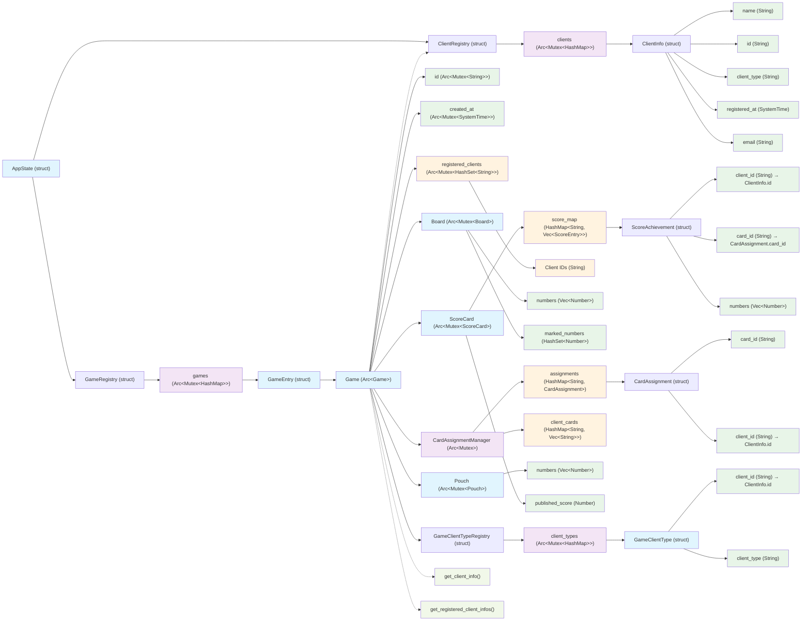

# Tombola Data Model

This document represents the data model of the Tombola application and the relationships between different entities.

## Data Model Tree Map



## Key Relationships

1. **AppState (struct)** serves as the root container holding:
   - A **GameRegistry (struct)** for managing multiple game instances
   - A **ClientRegistry (struct)** for global client management

2. **GameRegistry** manages game instances using the **encapsulated Arc<Mutex> pattern**:
   - Contains **games: Arc<Mutex<HashMap<String, GameEntry>>>** with internal thread safety
   - Each **GameEntry** wraps a **Game** instance with metadata
   - Provides clean public API methods that handle locking internally

3. **ClientRegistry** manages all client information globally using the **encapsulated Arc<Mutex> pattern**:
   - Contains **clients: Arc<Mutex<HashMap<String, ClientInfo>>>** with internal thread safety  
   - Stores **ClientInfo (struct)** objects with name, ID, client type, email, and timestamp
   - Provides clean public API methods (`get_by_name()`, `insert()`, etc.) that handle locking internally
   - Centralizes client validation and lookup across all games with proper error handling
   - **Email field is stored internally but not exposed through API responses**

4. **Game (struct)** instances maintain their own isolated state:
   - **registered_clients**: Arc<Mutex<HashSet<String>>> tracking registered client IDs
   - **client_type_registry**: GameClientTypeRegistry managing game-specific client types
   - **Board**: Arc<Mutex<Board>> containing extracted numbers and marked numbers
   - **Pouch**: Arc<Mutex<Pouch>> containing available numbers for extraction
   - **ScoreCard**: Arc<Mutex<ScoreCard>> tracking game scoring and achievements
   - **CardAssignmentManager**: Arc<Mutex<CardAssignmentManager>> managing card assignments

5. **GameClientTypeRegistry** manages game-specific client type associations:
   - **client_types**: Arc<Mutex<HashMap<String, String>>> mapping client IDs to their types within this game
   - Contains **GameClientType (struct)** objects linking client IDs to their game-specific types
   - Enables clients to have different roles across different games (e.g., "player" in one game, "board" in another)
   - Provides methods like `set_client_type()`, `is_client_type()`, `get_clients_by_type()`

6. **Game-ClientRegistry Integration**: Game provides methods to properly reference global ClientRegistry:
   - `get_registered_client_infos()`: Returns full ClientInfo for all clients registered in this game
   - `get_client_info(client_id, registry)`: Returns ClientInfo for a specific client if registered
   - `registered_client_count()`: Returns count of registered clients
   - `get_registered_client_ids()`: Returns list of registered client IDs
   - This ensures Game references ClientInfo from the global registry rather than maintaining separate entities

7. **CardAssignmentManager** handles card operations:
   - **assignments**: HashMap<String, CardAssignment> mapping card IDs to assignments
   - **client_cards**: HashMap<String, Vec<String>> mapping client IDs to their cards
   - Provides card generation, assignment, and ownership tracking

8. **Improved Architecture Benefits**:
   - **Encapsulation**: Thread safety is hidden as implementation detail in both registries
   - **Cleaner API**: `client_registry.get_by_name()` vs `app_state.global_client_registry.lock().unwrap().get()`
   - **Error Handling**: Methods return `Result<T, String>` for consistent error management
   - **Consistency**: Both GameRegistry and ClientRegistry follow the same architectural pattern
   - **Maintainability**: Callers don't need to handle mutex locking complexities
   - **Single Source of Truth**: Game references ClientInfo from global registry instead of maintaining separate entities
   - **Data Integrity**: No risk of Game's client info becoming out of sync with global registry
   - **Referential Integrity**: ScoreAchievement.client_id references ClientInfo.id, ScoreAchievement.card_id references CardAssignment.card_id, CardAssignment.client_id references ClientInfo.id, GameClientType.client_id references ClientInfo.id
   - **Game-Specific Authorization**: GameClientTypeRegistry enables flexible client authorization per game without affecting global client identity

This architecture ensures clean separation between global client management, game registry management, and individual game state isolation with proper thread safety and encapsulation.

## JSON Dump Structure

The game dump functionality serializes the complete game state to JSON files in `data/games/`. The JSON structure directly reflects the data model:

```json
{
  "id": "game_xxxxxxxx",
  "created_at": { "secs_since_epoch": 1753262774, "nanos_since_epoch": 664070800 },
  "board": {
    "numbers": [67, 59, 31, 24, ...],
    "marked_numbers": []
  },
  "pouch": {
    "numbers": [1, 2, 3, 4, 5, ...]
  },
  "scorecard": {
    "published_score": 15,
    "score_map": {
      "5": [{ "client_id": "C6B6DF1363C4360E", "card_id": "36CBF214F38EAE3D", "numbers": [12, 33, 44, 71, 81] }],
      "2": [{ "client_id": "89C5D03DB5F88410", "card_id": "78B3DCA39852E011", "numbers": [31, 88] }]
    }
  },
  "registered_clients": ["89C5D03DB5F88410", "C6B6DF1363C4360E"],
  "client_type_registry": {
    "client_types": {
      "89C5D03DB5F88410": "player",
      "C6B6DF1363C4360E": "player",
      "0000000000000000": "board"
    }
  },
  "card_manager": {
    "assignments": {
      "card_id": { "card_id": "...", "client_id": "...", "card_data": [[...]] }
    },
    "client_cards": {
      "client_id": ["card1", "card2", ...]
    }
  },
  "game_ended_at": { "secs_since_epoch": 1753262885, "nanos_since_epoch": 683387400 }
}
```

### Key JSON Structure Notes:

1. **Client References**: The JSON dumps only contain client IDs, not full ClientInfo objects (supporting our architecture decision)
2. **Game-Specific Client Types**: The client_type_registry section shows client types within this specific game context
3. **ScoreCard Complexity**: The score_map contains detailed scoring entries grouped by score value
4. **Timestamp Format**: SystemTime is serialized as seconds and nanoseconds since epoch
5. **Card Data**: Full card assignments and client-card mappings are preserved
6. **Game Lifecycle**: Both game creation and end timestamps are recorded
7. **Email Privacy**: ClientInfo email field is stored internally but excluded from JSON dumps and API responses
8. **Game Isolation**: Each JSON dump contains only data for that specific game, including game-specific client types
