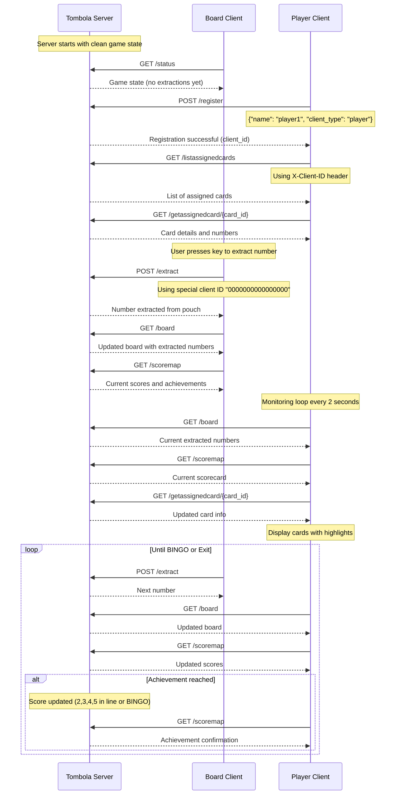
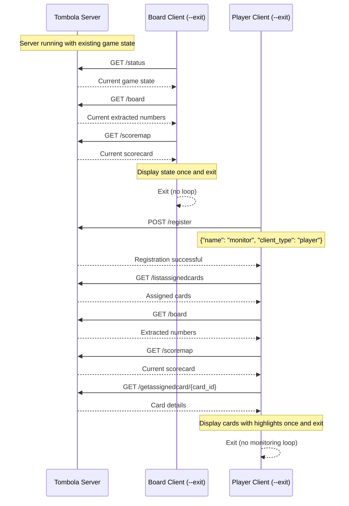
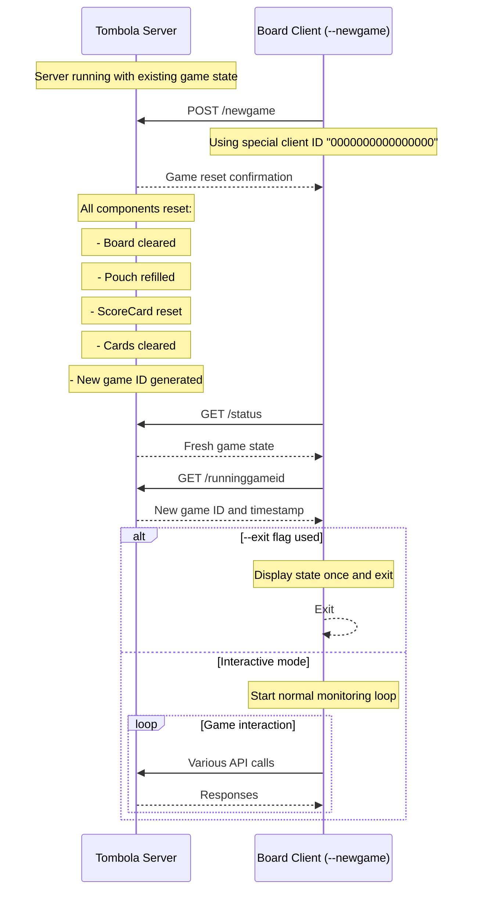
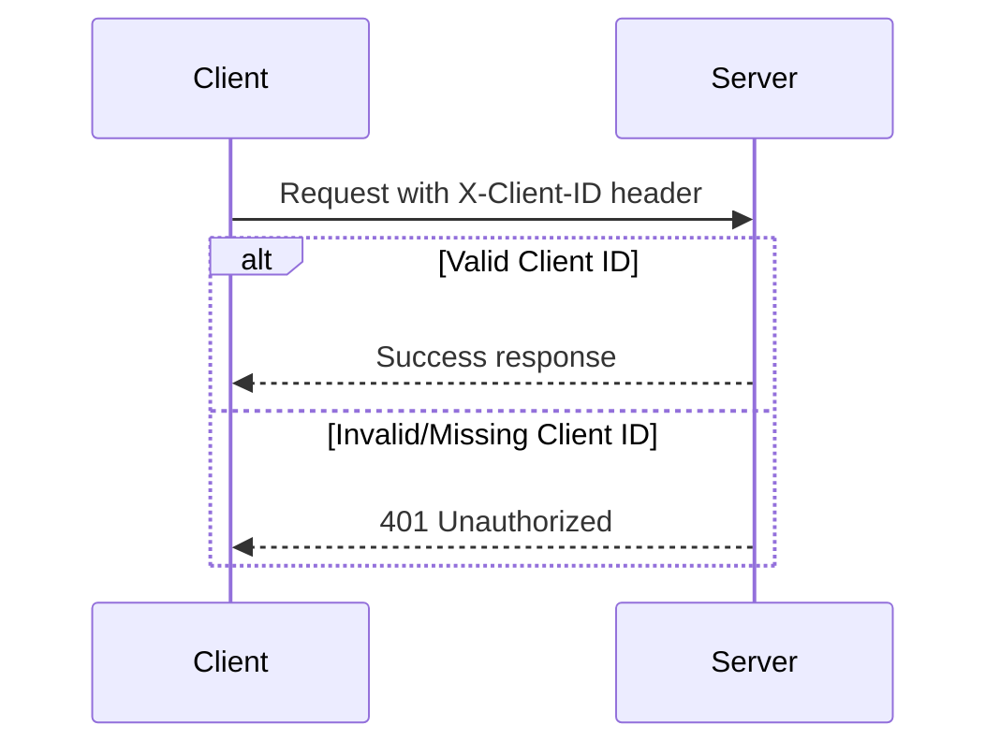
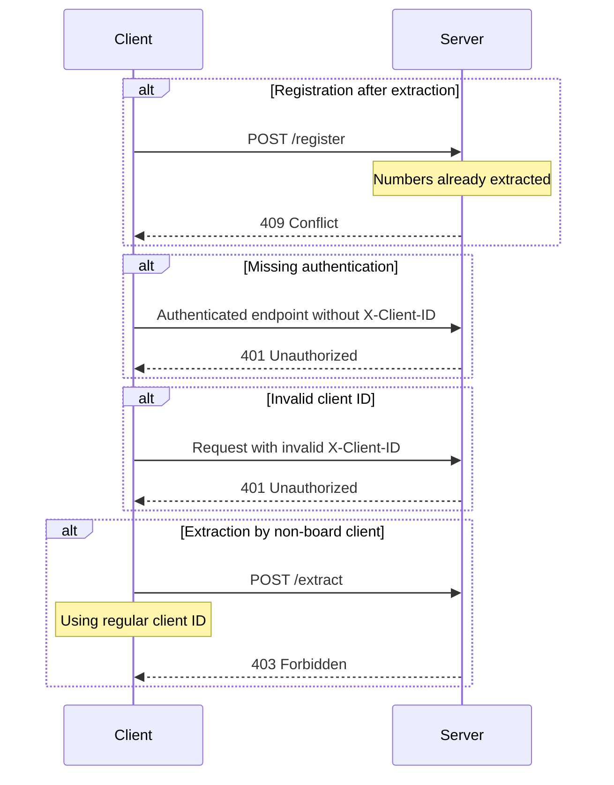
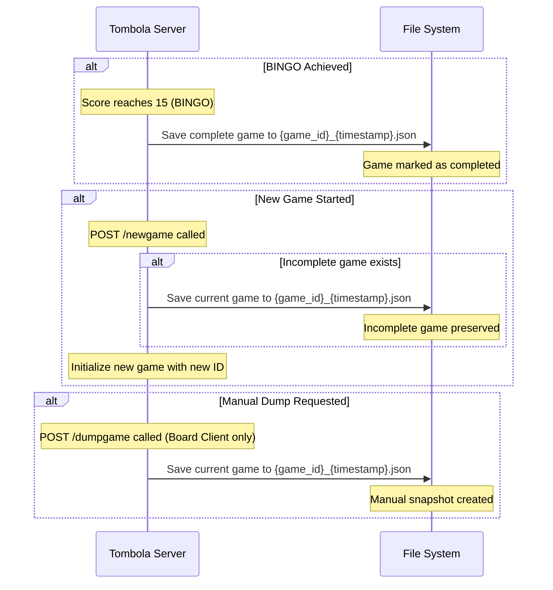

# Tombola Game Flow Documentation

This document describes the interaction flows between the Tombola server and its clients, including sequence diagrams for different usage scenarios.

### Game State Management

The server uses a unified **Game super struct** that encapsulates all game state:

- **Unique Game IDs**: Each game instance has a randomly generated 8-digit hexadecimal identifier (format: `game_12345678`)
- **Creation Timestamps**: Games include creation timestamps for tracking and debugging purposes
- **Thread-Safe Components**: Board, Pouch, ScoreCard, ClientRegistry, and CardAssignmentManager
- **Coordinated Access**: All components wrapped in `Arc<Mutex<T>>` for thread safety
- **Enhanced API**: Game ID and creation time included in status and reset responses

## Client Registration and Game Flow

### Standard Interactive Flow

### Non-Interactive Flow (--exit flag)

### Game Reset Flow

## Client Authentication

### Special Client IDs

- **Board Client**: Uses special client ID `"0000000000000000"` (16 zeros)
  - Can perform extractions via `/extract`
  - Can reset game via `/newgame`
  - No registration required

- **Player Clients**: Use dynamically generated 16-character hexadecimal IDs
  - Must register via `/register` before accessing other endpoints
  - Cannot extract numbers or reset games
  - Can only access their own assigned cards

### Header Authentication

## API Endpoint Categories

### Public Endpoints (No Authentication Required)
- `GET /status` - Server and game status
- `GET /runninggameid` - Current game ID and creation time
- `GET /board` - Current extracted numbers
- `GET /pouch` - Remaining numbers in pouch
- `GET /scoremap` - Current scorecard and achievements
- `POST /register` - Client registration

### Authenticated Endpoints (Require X-Client-ID)
- `POST /extract` - Extract number from pouch (Board Client only)
- `POST /newgame` - Reset game state (Board Client only)
- `POST /dumpgame` - Dump game state to JSON (Board Client only)
- `GET /clientinfo` - Get client info by name
- `GET /clientinfo/{client_id}` - Get client info by ID
- `POST /generatecards` - Generate cards for client
- `GET /listassignedcards` - List client's assigned cards
- `GET /getassignedcard/{card_id}` - Get specific card details

## Error Handling

### Common Error Scenarios

## Configuration and Deployment

### Server Configuration
- **Host**: 127.0.0.1 (localhost only)
- **Port**: 3000
- **Protocol**: HTTP/1.1
- **Runtime**: Tokio async runtime

### Client Configuration
- **Connection timeout**: 30 seconds
- **Server URL**: Configurable via client config files
- **Client names**: Configurable via CLI or config files

### Thread Safety
- All shared state uses `Arc<Mutex<T>>` for thread-safe access
- Coordinated mutex acquisition order prevents deadlocks
- Unified Game struct manages all components

## Game State Persistence

The Tombola server includes automatic game state persistence features:

### Automatic JSON Dumps
Game state is automatically saved to `data/games/` directory in the following scenarios:

### File Format
- **Location**: `data/games/` directory
- **Naming**: `{game_id}_{timestamp}.json` format
- **Content**: Complete game state including:
  - Board state (extracted numbers)
  - Pouch state (remaining numbers)
  - ScoreCard (current scores and achievements)
  - Client registry (all registered clients)
  - Card assignments (all assigned cards)
- **Format**: Pretty-printed JSON for human readability

### Security Considerations
- Only the Board Client (ID: "0000000000000000") can trigger manual dumps via `/dumpgame`
- Automatic dumps occur without authentication requirements
- Game files are stored locally in the server's file system

### Integration with External Tools
Non-interactive mode allows integration with:
- Monitoring dashboards
- Automation scripts
- CI/CD pipelines
- External notifications systems
