# Tombola Game Flow Documentation

This document describes the interaction flows between the Tombola server and its clients, including sequence diagrams for different usage scenarios in the multi-game architecture.

## Multi-Game Architecture Overview

The server uses a **GameRegistry** system that supports multiple concurrent games:

- **Game-Specific Routing**: All game operations use `/{game_id}/` routing for complete isolation
- **Unique Game IDs**: Each game instance has a randomly generated 8-digit hexadecimal identifier (format: `game_12345678`)
- **Creation Timestamps**: Games include creation timestamps for tracking and debugging purposes
- **Thread-Safe Components**: Board, Pouch, ScoreCard, ClientRegistry, and CardAssignmentManager per game
- **Coordinated Access**: All components wrapped in `Arc<Mutex<T>>` for thread safety
- **Game Management**: `/newgame` for creation, `/gameslist` for discovery
- **Smart Client Discovery**: Automatic game listing when clients run without specified game ID

## Smart Client Discovery Flow

### Automatic Game Discovery

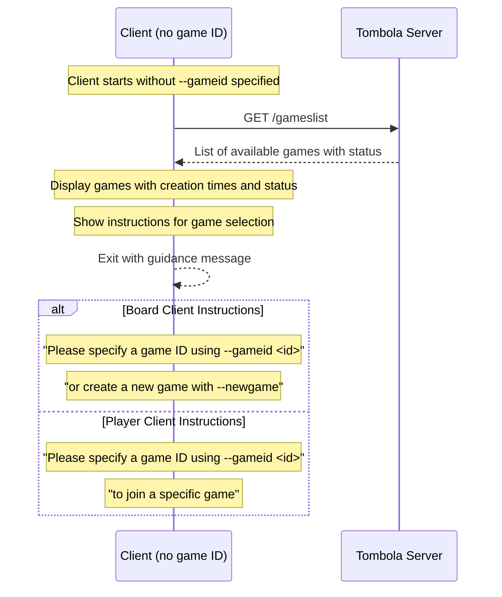

### Explicit Game Listing

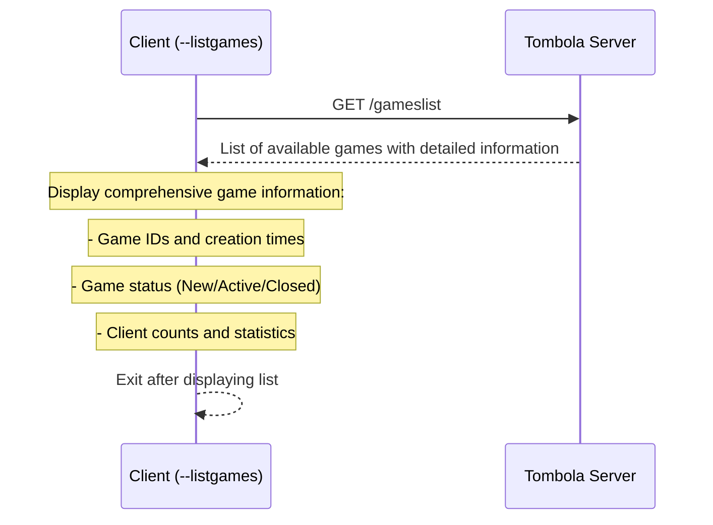

## Multi-Game Client Registration and Game Flow

### Standard Interactive Flow with Game Selection

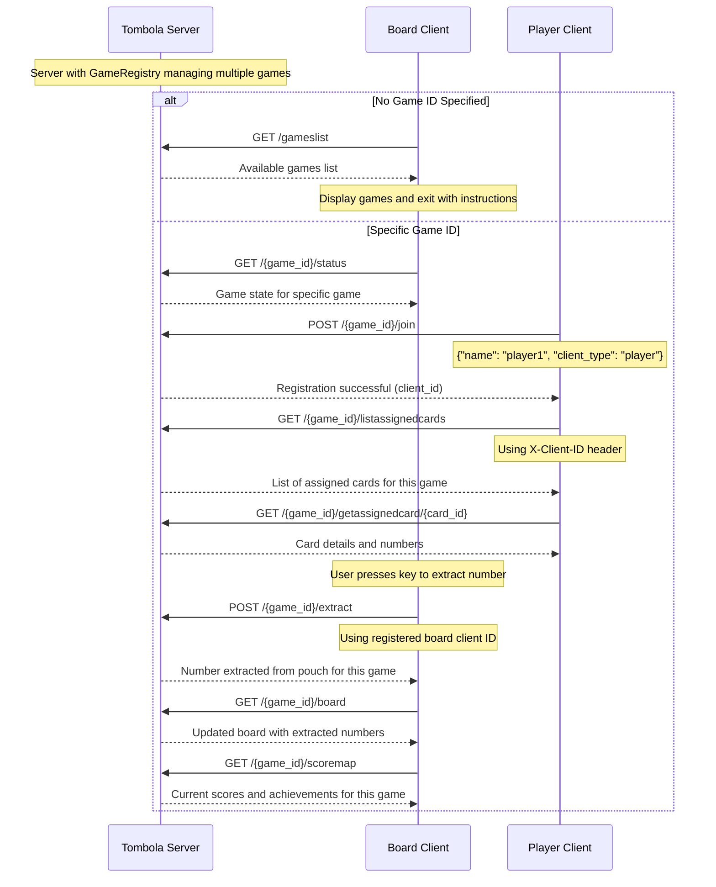

### Game Creation Flow

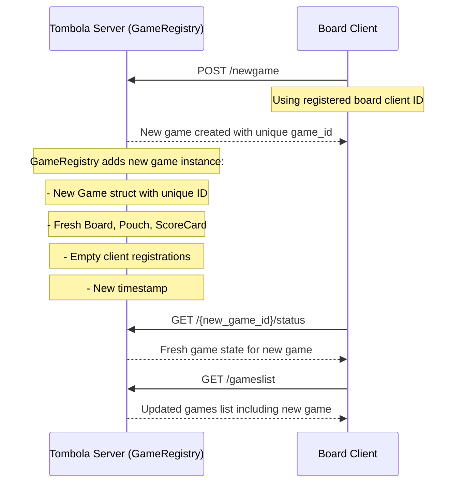

### Game Monitoring Flow

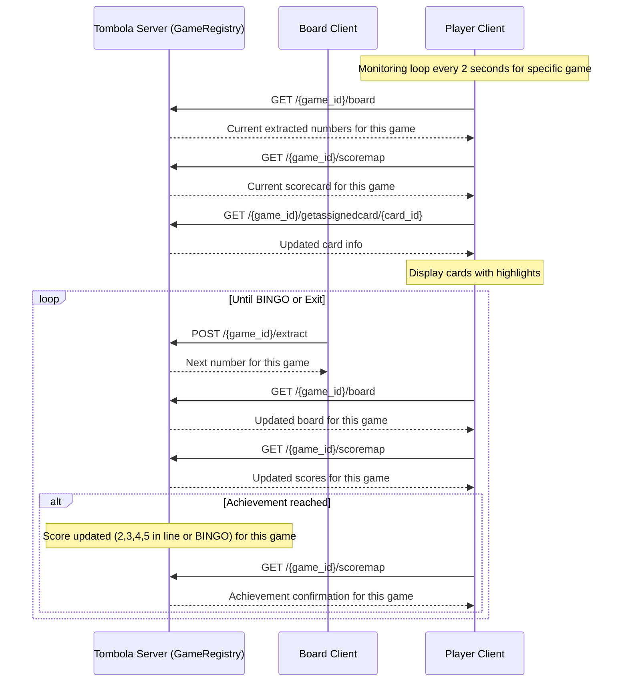

### Multi-Game Concurrent Flow

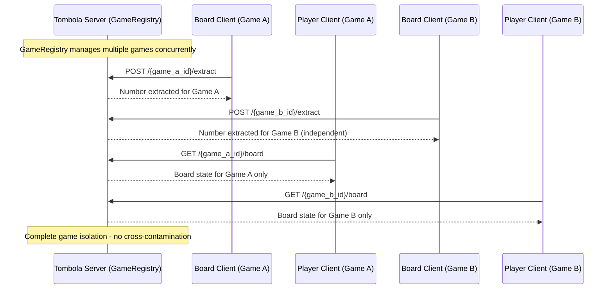

### Non-Interactive Flow (--exit flag)

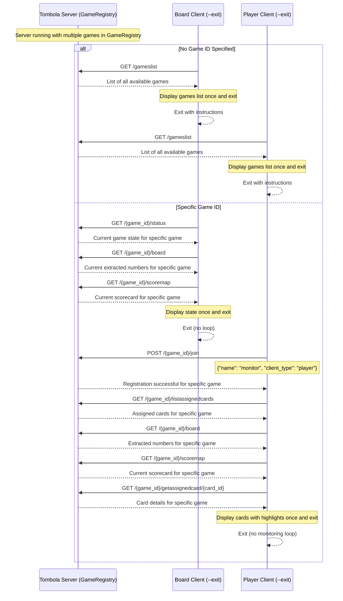

### Game Reset Flow (Multi-Game Context)

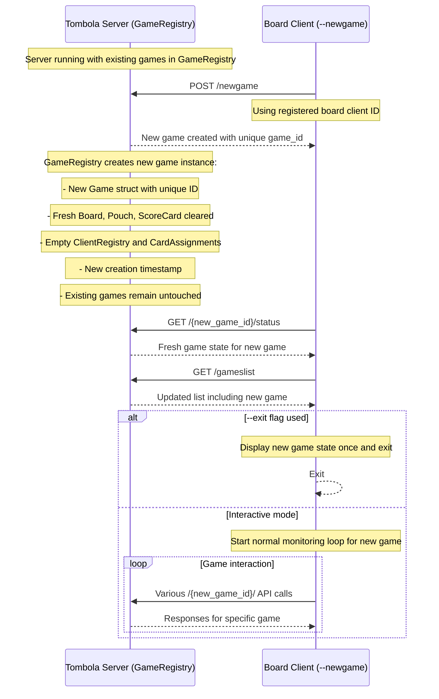

## Client Authentication

### Client Authentication and Registration

- **Board Clients**: Register with client_type "board"
  - Must register to each game they want to manage via `/{game_id}/join`
  - Receive special BOARD_ID card (`"0000000000000000"`) during registration
  - Can perform extractions via `/{game_id}/extract`
  - Can create new games via `/newgame`
  - Can dump game state via `/{game_id}/dumpgame`

- **Player Clients**: Register with client_type "player"
  - Must register via `/{game_id}/join` before accessing game-specific endpoints
  - Receive regular numbered cards during registration
  - Cannot extract numbers or create games
  - Can only access their own assigned cards within specific games
  - Must register separately for each game they want to join

### Multi-Game Header Authentication

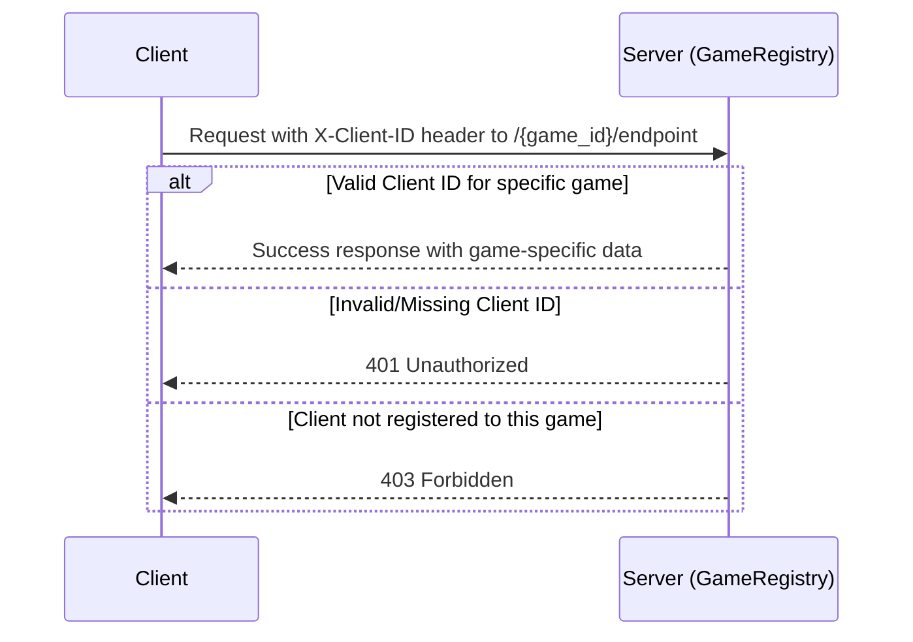

## API Endpoint Categories

### Global Endpoints (No Game ID Required)
- `POST /newgame` - Create new game (board client only)
- `GET /gameslist` - List all available games
- `GET /clientinfo` - Get client info by name (global search)
- `GET /clientinfo/{client_id}` - Get client info by ID (global search)

### Game-Specific Public Endpoints (No Authentication Required)
- `GET /{game_id}/status` - Server and specific game status
- `GET /{game_id}/board` - Current extracted numbers for game
- `GET /{game_id}/pouch` - Remaining numbers in pouch for game
- `GET /{game_id}/scoremap` - Current scorecard and achievements for game
- `POST /{game_id}/join` - Client registration to specific game

### Game-Specific Authenticated Endpoints (Require X-Client-ID)
- `POST /{game_id}/extract` - Extract number from pouch (Board Client only)
- `POST /{game_id}/dumpgame` - Dump game state to JSON (Board Client only)
- `POST /{game_id}/generatecards` - Generate cards for client in game
- `GET /{game_id}/listassignedcards` - List client's assigned cards in game
- `GET /{game_id}/getassignedcard/{card_id}` - Get specific card details in game

## Error Handling

### Common Error Scenarios

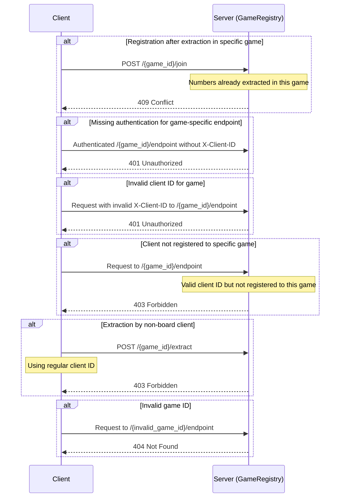

## Configuration and Deployment

### Server Configuration
- **Host**: 127.0.0.1 (localhost only)
- **Port**: 3000
- **Protocol**: HTTP/1.1
- **Runtime**: Tokio async runtime
- **Architecture**: Multi-game with GameRegistry

### Client Configuration
- **Connection timeout**: 30 seconds
- **Server URL**: Configurable via client config files
- **Client names**: Configurable via CLI or config files
- **Game Selection**: Via `--gameid` CLI option or automatic discovery

### Thread Safety
- **GameRegistry**: Thread-safe access to multiple games
- **Per-Game State**: All shared state uses `Arc<Mutex<T>>` for thread-safe access
- **Coordinated Access**: Proper mutex acquisition order prevents deadlocks
- **Game Isolation**: Complete separation of game state between different games

## Game State Persistence

The Tombola server includes automatic game state persistence features:

### Automatic JSON Dumps
Game state is automatically saved to `data/games/` directory in the following scenarios:

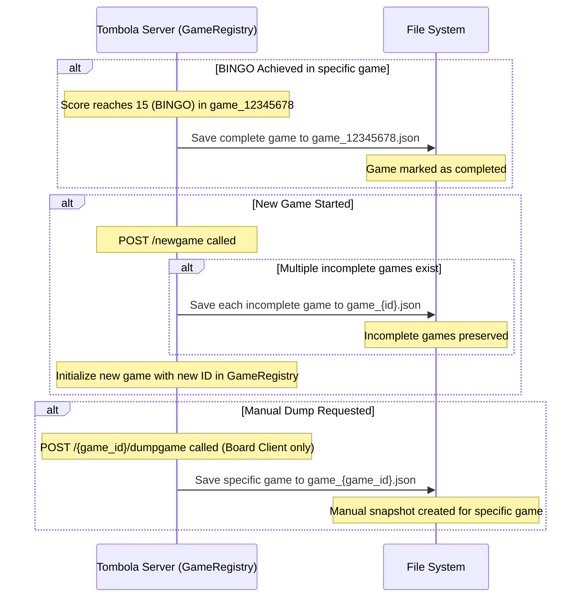

### File Format
- **Location**: `data/games/` directory
- **Naming**: `game_{game_id}.json` format (e.g., `game_12345678.json`)
- **Content**: Complete game state including:
  - Board state (extracted numbers)
  - Pouch state (remaining numbers)
  - ScoreCard (current scores and achievements)
  - Client registry (all registered clients for this game)
  - Card assignments (all assigned cards for this game)
- **Format**: Pretty-printed JSON for human readability
- **Game Isolation**: Each game file contains only that game's data

### Security Considerations
- Only registered board clients (client_type "board") can trigger manual dumps via `/{game_id}/dumpgame`
- Automatic dumps occur without authentication requirements
- Game files are stored locally in the server's file system
- Each game's data is completely isolated from other games

### Integration with External Tools
Non-interactive mode allows integration with:
- Monitoring dashboards showing multiple games
- Automation scripts for game management
- CI/CD pipelines for testing multiple game scenarios
- External notifications systems for multi-game events
