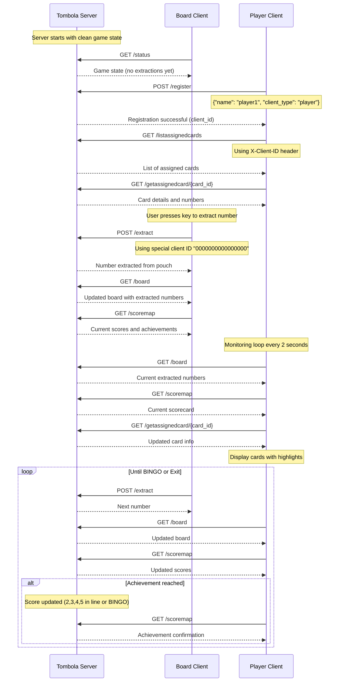
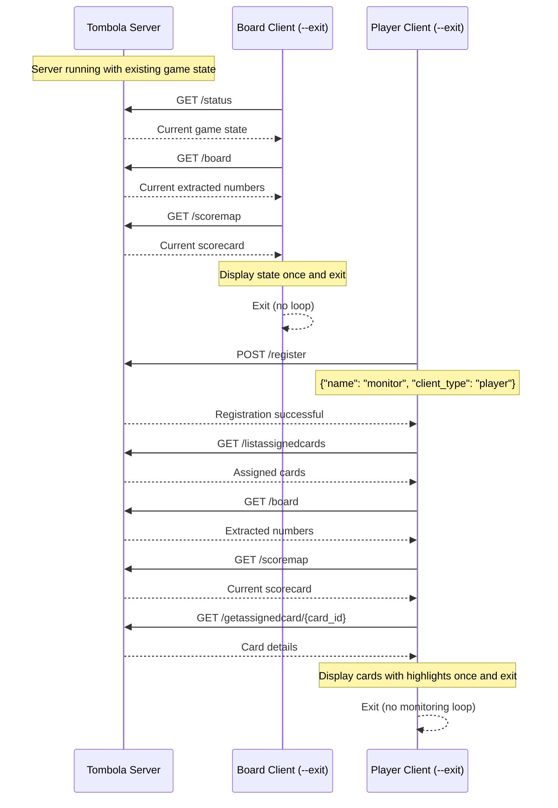
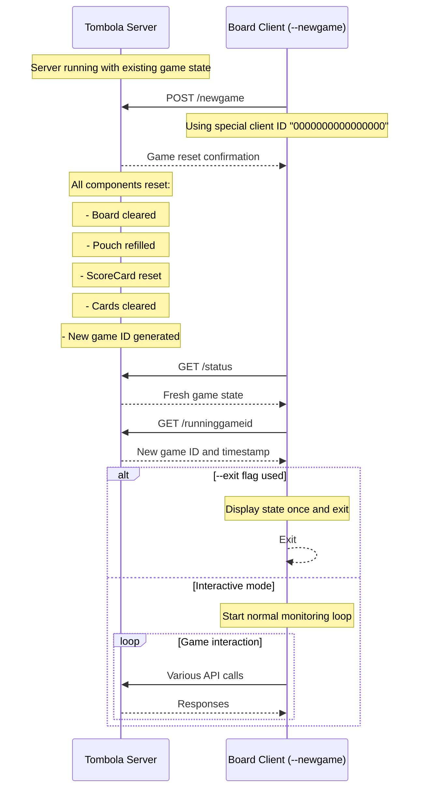
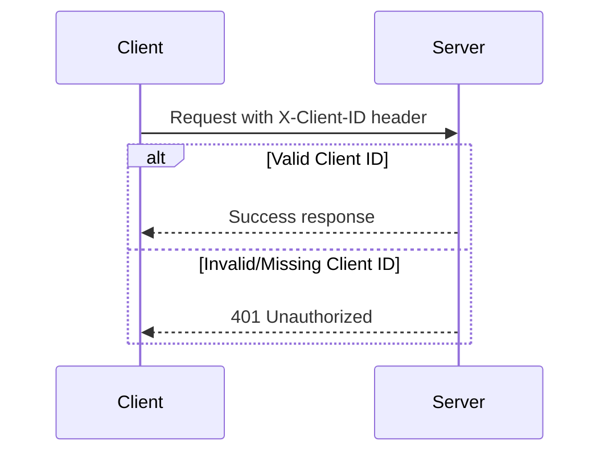
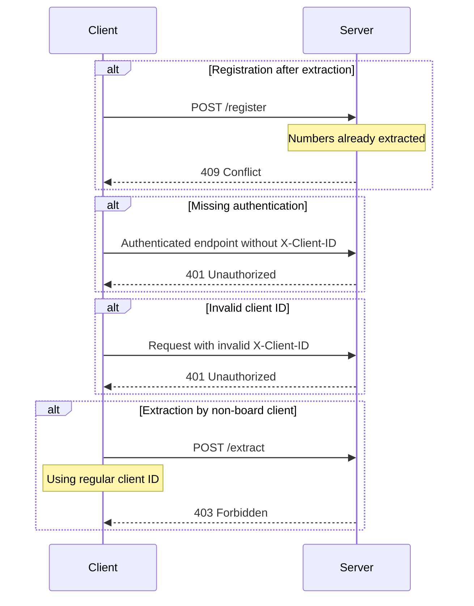

# Tombola Game Flow Documentation

This document describes the interaction flows between the Tombola server and its clients, including sequence diagrams for different usage scenarios.

## Architecture Overview

The Tombola game consists of three main components:

1. **Tombola Server** (`tombola-server`): Main game server with terminal UI and HTTP API
2. **Board Client** (`tombola-client`): Terminal client for displaying game state and performing extractions
3. **Player Client** (`tombola-player`): Interactive client for card management and gameplay

## Client Registration and Game Flow

### Standard Interactive Flow



### Non-Interactive Flow (--exit flag)



### Game Reset Flow



## Client Authentication

### Special Client IDs

- **Board Client**: Uses special client ID `"0000000000000000"` (16 zeros)
  - Can perform extractions via `/extract`
  - Can reset game via `/newgame`
  - No registration required

- **Player Clients**: Use dynamically generated 16-character hexadecimal IDs
  - Must register via `/register` before accessing other endpoints
  - Cannot extract numbers or reset games
  - Can only access their own assigned cards

### Header Authentication



## API Endpoint Categories

### Public Endpoints (No Authentication Required)
- `GET /status` - Server and game status
- `GET /runninggameid` - Current game ID and creation time
- `GET /board` - Current extracted numbers
- `GET /pouch` - Remaining numbers in pouch
- `GET /scoremap` - Current scorecard and achievements
- `POST /register` - Client registration

### Authenticated Endpoints (Require X-Client-ID)
- `POST /extract` - Extract number from pouch (Board Client only)
- `POST /newgame` - Reset game state (Board Client only)
- `GET /client/{name}` - Get client info by name
- `GET /clientbyid/{id}` - Get client info by ID
- `POST /generatecardsforme` - Generate cards for client
- `GET /listassignedcards` - List client's assigned cards
- `GET /getassignedcard/{card_id}` - Get specific card details

## Error Handling

### Common Error Scenarios



## Configuration and Deployment

### Server Configuration
- **Host**: 127.0.0.1 (localhost only)
- **Port**: 3000
- **Protocol**: HTTP/1.1
- **Runtime**: Tokio async runtime

### Client Configuration
- **Connection timeout**: 30 seconds
- **Server URL**: Configurable via client config files
- **Client names**: Configurable via CLI or config files

### Thread Safety
- All shared state uses `Arc<Mutex<T>>` for thread-safe access
- Coordinated mutex acquisition order prevents deadlocks
- Unified Game struct manages all components

## Usage Patterns

### Automation and Monitoring
The `--exit` flag enables non-interactive usage patterns:

```bash
# Status monitoring script
while true; do
    cargo run --bin tombola-client -- --exit
    sleep 30
done

# Player monitoring
cargo run --bin tombola-player -- --name "Monitor" --exit > game_state.txt
```

### Integration with External Tools
Non-interactive mode allows integration with:
- Monitoring dashboards
- Automation scripts
- CI/CD pipelines
- External notifications systems

### Development and Testing
The `--newgame` flag combined with `--exit` enables:
- Automated testing scenarios
- Development environment setup
- Game state reset in scripts
